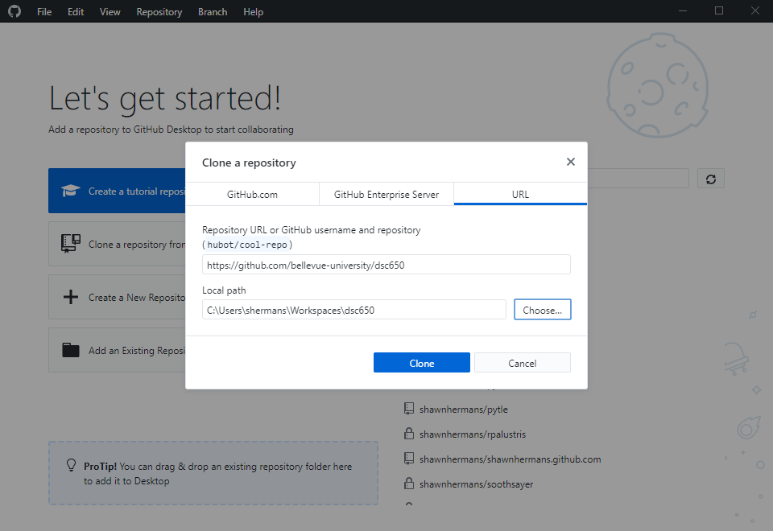
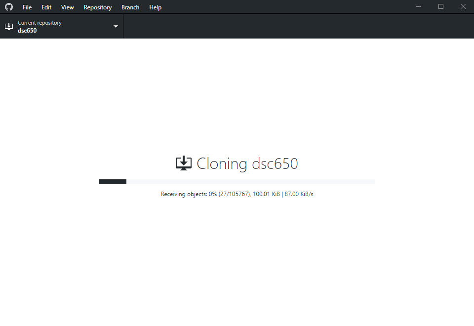
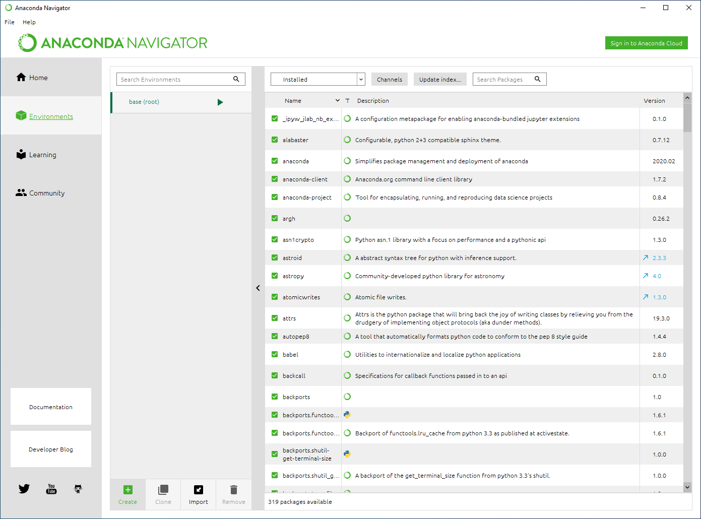
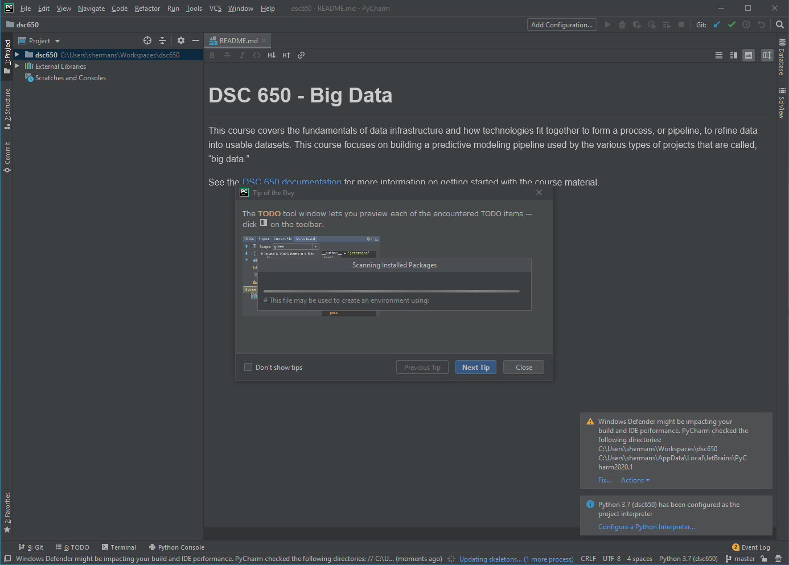
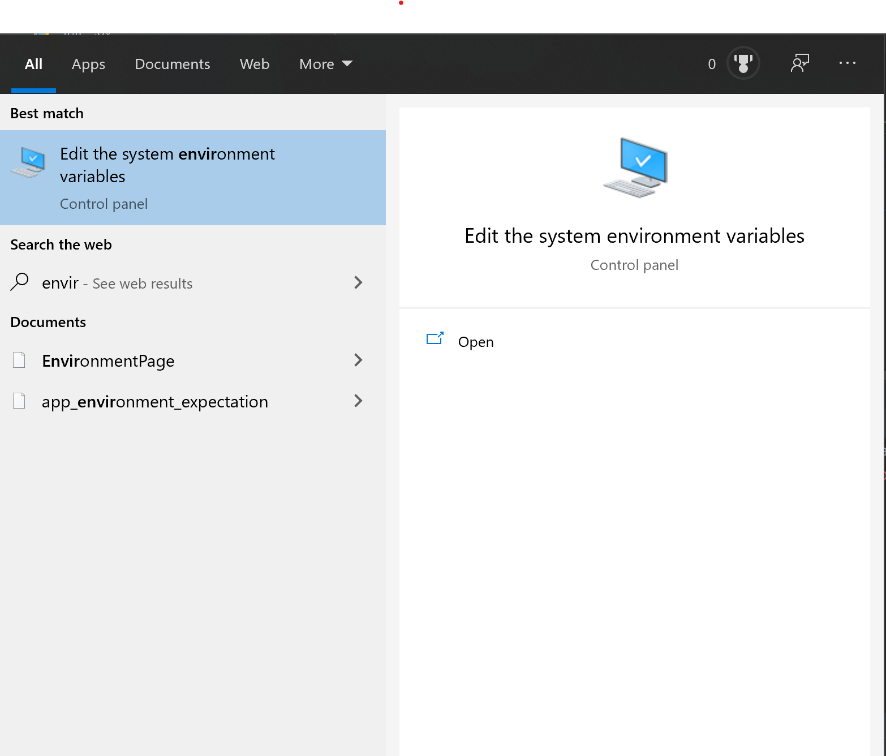
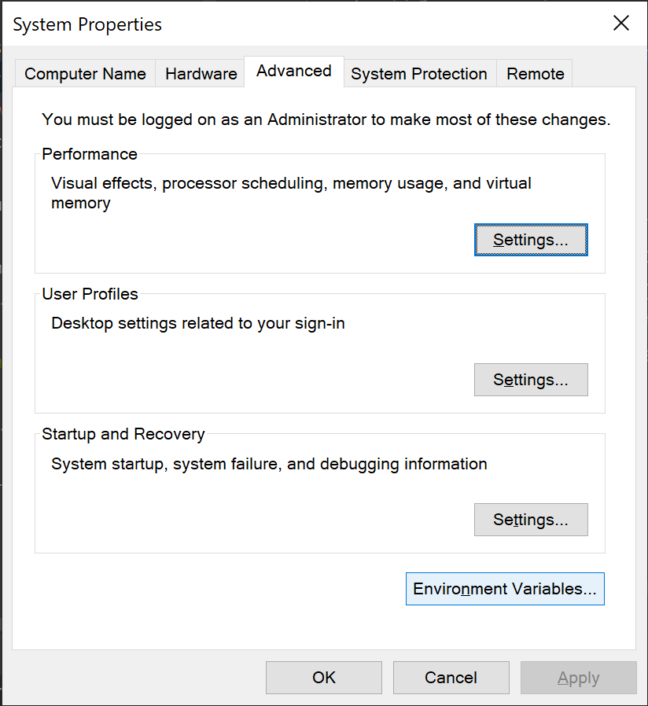
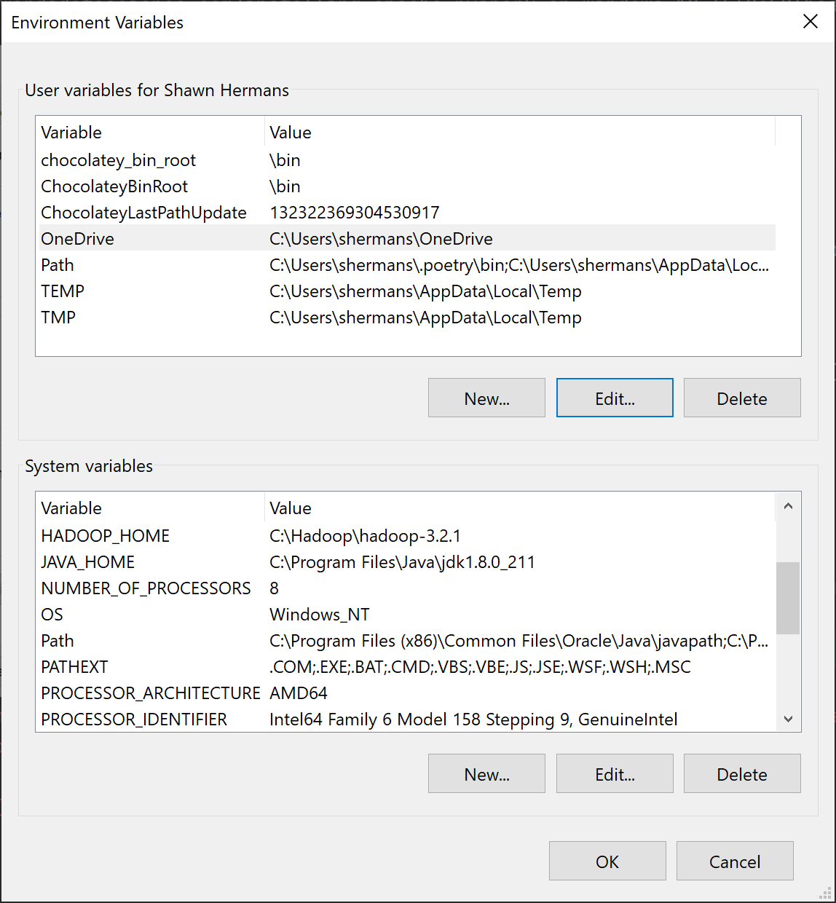
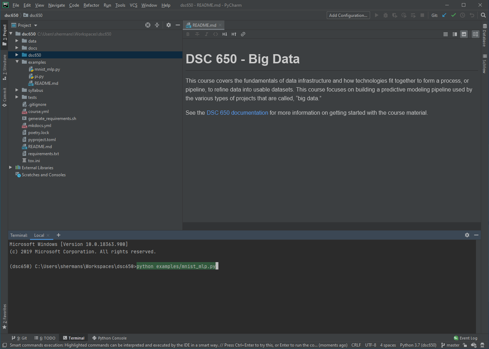
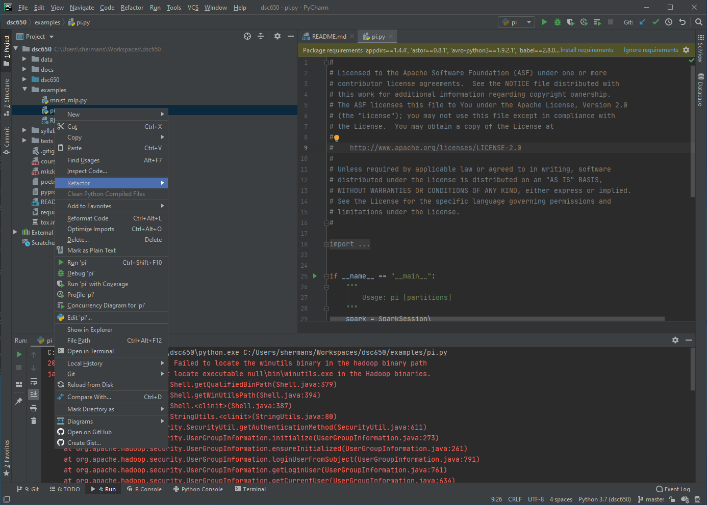
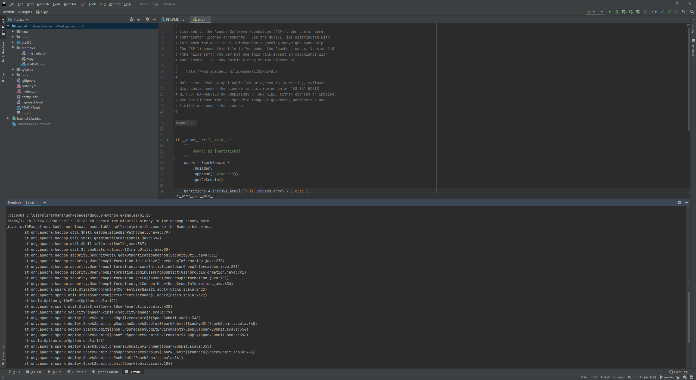

# Windows

!!! warning "Documentation in Progress"
    Check back soon for more updates.

## Overview

There are multiple options available for installing Spark, Hadoop, TensorFlow, and other Big Data/Deep Learning software on Windows 10. While it is possible to install these packages and use these packages on Windows, I strongly urge you to heed the warning of François Chollet, author of [Deep Learning With Python][deep-learning-with-python].

> Whether you’re running locally or in the cloud, it’s better to be using a Unix workstation. Although it’s technically possible to use Keras on Windows (all three Keras backends support Windows), We don’t recommend it. In the installation instructions in appendix A, we’ll consider an Ubuntu machine. If you’re a Windows user, the simplest solution to get everything running is to set up an Ubuntu dual boot on your machine. It may seem like a hassle, but using Ubuntu will save you a lot of time and trouble in the long run.

## Prerequisites

Install this software prior to setting up your environment.

* [Atom \(Optional\)](https://atom.io/)
* [GitHub Desktop](https://desktop.github.com/)
* [Git](https://git-scm.com/downloads)
* [Anaconda](https://www.anaconda.com/products/individual#Downloads)
* [Java Development Kit 8](https://www.oracle.com/java/technologies/javase/javase-jdk8-downloads.html)
* [PyCharm](https://www.jetbrains.com/pycharm/download/)

## Clone GitHub Repository

Using GitHub Desktop, clone the `bellevue-university/dsc650` repository by going to https://github.com/bellevue-university/dsc650 and selecting the `Open In Desktop` option.


Clone the repository to your local system by selecting the appropriate local directory. After selecting the directory, you will see a screen that shows the repository cloning to your local directory.  This process may take a long time (minutes to hours), so wait until it is completed.





## Import Environment

Next, open Anaconda Navigator.  


Select the `channels` option to add the `conda-forge` channel.  


After you have finished adding the Conda Forge channel, import a new environment by selecting the environments tab and the import option.  



Import the `environment.yaml` file from the `dsc650` repository to the `dsc650` environment. This will create an Anaconda environment with the appropriate dependencies.

## Open PyCharm Project

Open PyCharm where you should see a screen welcoming you to Pycharm.


Select the open option and open the directory where you cloned the `dsc650` repository.


When you initially open the project, it may ask you to fix issues with Windows Defender.  Fix the issues by clicking the `fix` option and following the prompts.




PyCharm should automatically use the previously created `dsc650` environment.  If not, go to the `project-interpreter` option in the menu and add the Conda environment.


## Set Sources Root

After opening the project, right click the `dsc650` directory and add it as a sources root.


## Set Java Home

| Variable      | Value                              |
|---------------|------------------------------------|
| JAVA_HOME     | C:\Program Files\Java\jdk1.8.0_251 |

Go the `edit system environment variables` in your control panel.



Under `System Properties -> Advanced` select `Environment Variables`.



Change the environment variables for your user.



Exit out of PyCharm and re-open to ensure it sets the environment variables.  

## Run Examples

Run the TensorFlow example.



Run the PySpark example.



Or you can run the PySpark example in the terminal.



## Package Manager (Optional)

If you are using Windows as your primary development environment, I recommend using a package manager like [Chocolatey][chocolatey].

A package manager is a tool that automates the process of installing, updating, configuring, and removing computer programs. Package managers are commonly used on Unix and Linux distributions. Debian Linux systems, like Ubuntu, use `aptitude`. Red Hat and Fedora systems use `yum`.  `MacPorts` and `homebrew` are two popular package managers for macOS.

Follow the [Chocolatey installation guide][chocolatey-install] to install the package manager on your system.  Once you have completed installing the package manager, you can install new software by running PowerShell as an administrator and using the `choco` command.  For example, the following commands will install the latest versions of Adobe Acrobat Reader, Google Chrome, and FireFox on your system.

```shell
choco install adobereader
choco install googlechrome
choco install firefox
```

You can upgrade all packages using `choco upgrade all` or upgrade individual packages using `choco upgrade firefox`.  Similarly, you can uninstall packages using `choco uninstall`.

The following is a table of software you might find useful for this course.

| Software                                   | Package Name      |
|--------------------------------------------|-------------------|
| Anaconda Distribution (Python 3.x)         | anaconda3         |
| Git (Install)                              | git.install       |
| GitHub Desktop                             | github-desktop    |
| Graphviz                                   | graphviz          |
| Hadoop                                     | hadoop            |
| Java Development Kit 8                     | jdk8              |
| JetBrains Toolbox App                      | jetbrainstoolbox  |
| JetBrains DataGrip                         | datagrip          |
| JetBrains PyCharm                          | pycharm           |
| JetBrains PyCharm Educational              | pycharm-edu       |
| JetBrains PyCharm (Community Edition) [^1] | pycharm-community |
| MikTeX                                     | miktex            |
| Pandoc                                     | pandoc            |
| Pandoc CrossRef                            | pandoc-crossref   |
| PostgreSQL                                 | postgresql        |
| Protocol Buffers                           | protoc            |
| Scala                                      | scala             |
| VirtualBox                                 | virtualbox        |


If you are interested to see what other packages are available, see [Chocolatey packages][chocolatey-packages] for a list of community maintained packages.


[^1]: While you can use the community version of PyCharm, JetBrains offers free educational licenses for students and teachers. See [educational licenses][jetbrains-education] for more details.

[chocolatey]: https://chocolatey.org/
[chocolatey-install]: https://chocolatey.org/install
[chocolatey-packages]: https://chocolatey.org/packages
[deep-learning-with-python]: https://www.manning.com/books/deep-learning-with-python
[jetbrains-education]: https://www.jetbrains.com/community/education/
[lubuntu]: https://lubuntu.me/
[pyspark-windows10-install]: https://towardsdatascience.com/installing-apache-pyspark-on-windows-10-f5f0c506bea1
[ubuntu-budgie]: https://ubuntubudgie.org/
[ubuntu-download-1804]: http://releases.ubuntu.com/18.04/
[ubuntu-download-2004]: http://releases.ubuntu.com/20.04/
[ubuntu-mate]: https://ubuntu-mate.org/
[winutils]: https://github.com/steveloughran/winutils
[wsl-install]: https://docs.microsoft.com/en-us/windows/wsl/install-win10
[xubuntu]: https://xubuntu.org/
